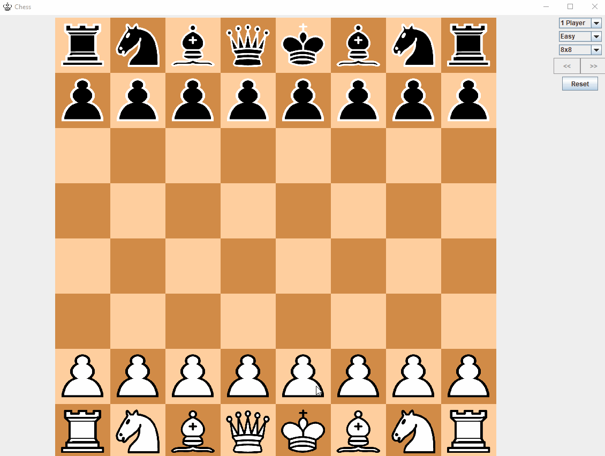

<h2>Table of Contents</h2>

<ul>
<li><a href="#sec-1">Chess</a>
<ul>
<li><a href="#sec-1-1">Screenshots</a></li>
<li><a href="#sec-1-2">Acknowledgments</a></li>
<li><a href="#sec-1-3">Other Projects</a></li>
</ul>
</li>
</ul>

# Chess

**Lightweight Chess game implemented using Java Swing UI**

## Screenshots

## Acknowledgments

-   **GPL 3.0 2016**, *Jaxson Van Doorn*

## Other Projects

-   [Woofers3D](https://github.com/woofers/woofers3d)

-   [Whale](https://github.com/woofers/whale)

-   [K9Krew](https://github.com/woofers/k9-krew)

-   [Dotfiles](https://github.com/woofers/dotfiles)
